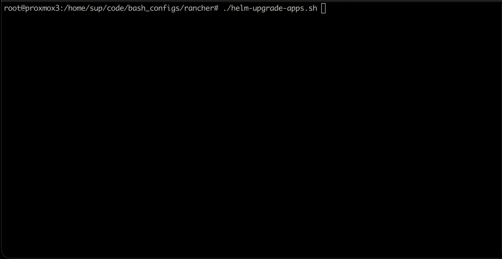

# Helm applications upgrade script

`helm-upgrade-apps.sh` contains PoC of script that I use to automate installing updates of applications installed on Kubernetes cluster via Helm Charts.



## Usage

From repo root:

```bash
./helm-upgrade-apps.sh
```

Options:

```bash
./helm-upgrade-apps.sh --help
./helm-upgrade-apps.sh --yes
./helm-upgrade-apps.sh --dry-run
./helm-upgrade-apps.sh --rollout-timeout 120s
./helm-upgrade-apps.sh --yes --rollout-timeout=60s
```

Environment override for rollout timeout:

```bash
ROLLOUT_TIMEOUT=2m ./helm-upgrade-apps.sh
```

## Runtime Behavior

Per app, the script does:
1. checks update availability
2. collects namespace/version/chart metadata
3. runs prechecks:
   - rollout checks only for release-labeled resources: `app.kubernetes.io/instance=<app>`
   - ingress HTTP code checks for all discovered hosts
4. asks whether to upgrade (unless `--yes`)
5. runs `helm upgrade` (unless `--dry-run`)
6. runs postchecks (rollout + ingress HTTP code checks)

## Logs and Exit Codes

Logs are written to:
- `./logs/helm-upgrade-YYYYmmdd-HHMMSS.log`

## Text colors in terminals

Text colors are enabled by default.
Text colors are disabled only when:
- `NO_COLOR` is set, or
- `TERM=dumb`